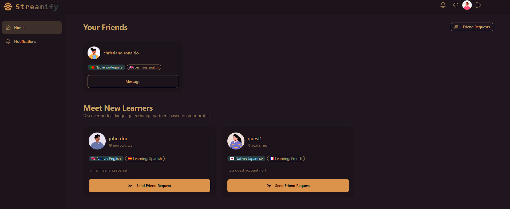
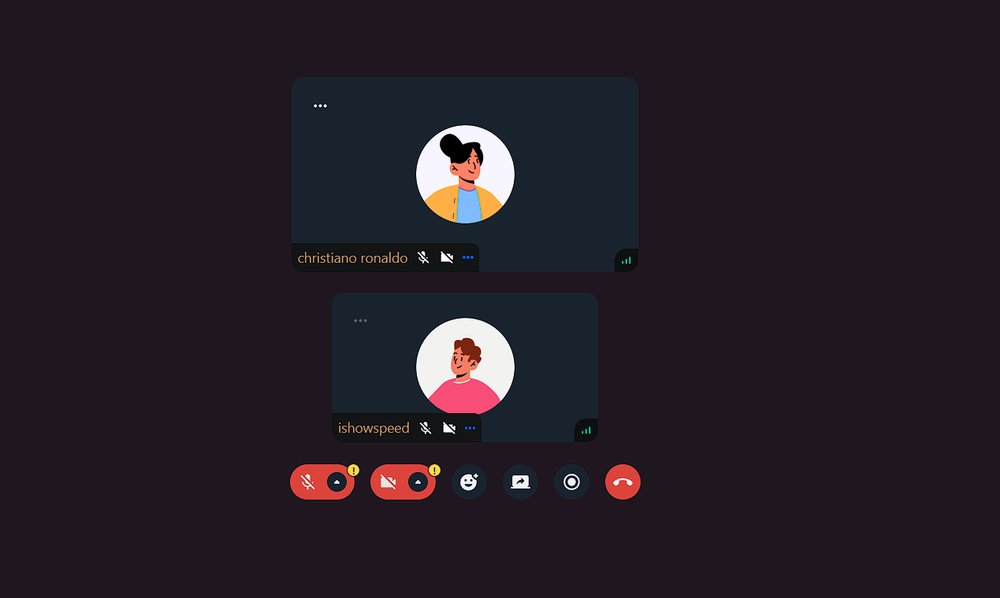
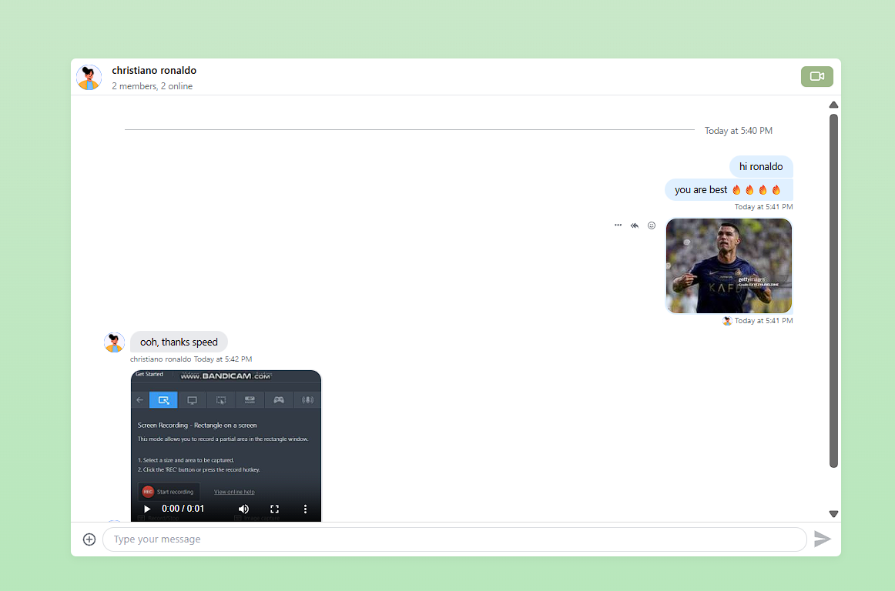
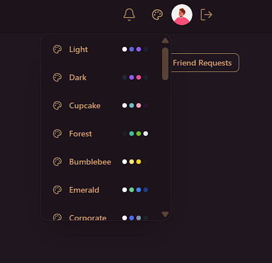

### 🗣️ Streamify Language Exchange

**Streamify Language Exchange** is a full-stack platform that connects language learners around the world. Practice speaking and chatting with fellow learners or native speakers via real-time chat and video calls — all in one sleek, modern app.

---

### 🌟 Highlights

- 🌐 Real-time Messaging with Typing Indicators & Reactions
- 📹 1-on-1 and Group Video Calls with Screen Sharing & Recording
- 🔐 JWT Authentication & Protected Routes
- 🌍 Language Exchange Platform with 32 Unique UI Themes
- ⚡ Tech Stack: React + Express + MongoDB + TailwindCSS + TanStack Query
- 🧠 Global State Management with Zustand
- 🚨 Error Handling (Frontend & Backend)
- 🚀 Free Deployment Ready
- 🎯 Built with Scalable Technologies like [Stream](https://getstream.io/)
- ⏳ And much more!

---

### 🚀 Live Demo 
[🌐 Visit Live Site](https://e-commerce-store-fzy2.onrender.com)

---
### 🛠️ Tech Stack

| Frontend       | Backend         | Realtime            | Other                   |
|----------------|------------------|----------------------|--------------------------|
| React, TailwindCSS, Zustand, TanStack Query | Node.js, Express | Stream Chat & Video | MongoDB, JWT, REST API |

---

### 🧑‍💻 Developer

Built entirely by a solo developer as a showcase project for resume and interviews.

---

### 📷 Screenshots & Demo

<p align="center"> 
 
 
 
</p>
<p align = "center">
 
 
</p> 
<p align="center"><i>✨ Real-time chat, video calling, and sleek UI in action ✨</i></p>

---

### 🚀 Getting Started

```bash
# 1. Clone the repo
git clone https://github.com/yourusername/streamify-language-exchange.git
cd streamify-language-exchange

# 2. Set up env variables (see `.env.example`)
cp .env.example .env

# 3. Install and run backend
cd backend
npm install
npm run dev

# 4. Install and run frontend
cd ../frontend
npm install
npm run dev
```

---

### 📝 .env Example (Backend)

```env
PORT=5000
MONGODB_URI=your_mongo_connection_string
STREAM_API_KEY=your_stream_key
STREAM_API_SECRET=your_stream_secret
JWT_SECRET=your_jwt_secret
```

---

### 📄 License 

This project is licensed under the [MIT License](./LICENSE).
